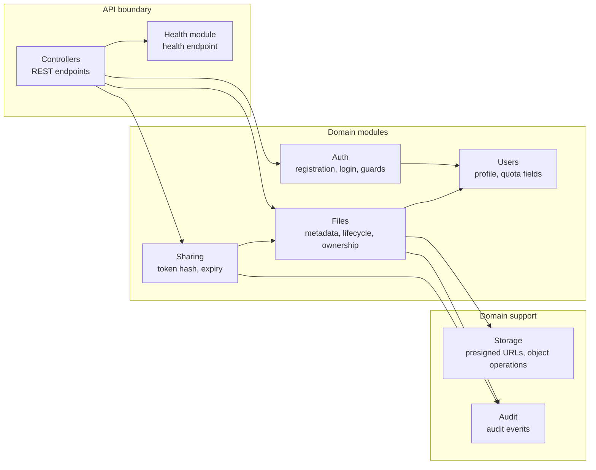
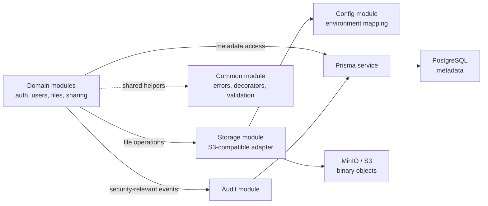

# C4 Component

## Statusz

Ez lightweight komponensnezet a kesobbi NestJS backend modulhataraihoz. Nem implementalt modulokat dokumental, hanem a tervezett felelossegeket es fuggosegi iranyokat rogziti.

## Cel

A komponensnezet segit abban, hogy a kesobbi backend scaffold ne egyetlen nagy service-be gyujtse az uzleti logikat. A controller retegek vekonyak maradnak, a szabalyok service-ekben es adapterekben lesznek tesztelhetok.

## Diagramok

A ket fokuszalt nezet ugyanazt a tervezett backend architekturat mutatja. Az elso a keresek es az uzleti modulok kozotti hivasokat, a masodik a kozos technikai es perzisztenciafuggosegeket emeli ki.

### API- es domainfolyam

### Technikai es perzisztenciafuggosegek

Ebben a nezetben a `Domain modules` doboz az elozo diagram `auth`, `users`, `files` es `sharing` moduljainak osszevont jelolese. Nem jelent uj backend komponenst.

## Tervezett backend modulok

| Modul | Felelosseg | Fontos szerzodes |
|---|---|---|
| `auth` | Regisztracio, login, password hash ellenorzes, JWT vagy valasztott session strategia, guardok. | Bejelentkezesi hiba nem arulhatja el, hogy email vagy jelszo volt hibas. |
| `users` | Felhasznaloi rekordok, `usedStorageBytes`, `storageLimitBytes`. | Usage adatot nem dashboardon szamolunk ujra `SUM(sizeBytes)` alapjan. |
| `files` | Fajlmetaadat, pending/active/deleted statusz, ownership, soft delete es restore. | Csak sajat aktiv fajl listazhato normal listaban; soft delete nem csokkenti a usage erteket. |
| `storage` | Storage interface, S3-kompatibilis adapter, presigned upload/read URL-ek. | Direct S3/MinIO SDK hivas nem szorodhat szet a codebase-ben. |
| `sharing` | Idokorlatos linkek, token hash, link ervenyesites. | A publikus link nem lehet tartos nyers S3 URL. |
| `audit` | Fontos muveletek audit esemenyei. | Nem logolhat credentialt, tokent, presigned URL-t vagy fajltartalmat. |
| `health` | Minimalis health endpoint kesobbi lokalis es uzemeltetesi ellenorzeshez. | Nem adhat vissza secretet vagy tul reszletes belso hibat. |
| `config` | Kornyezeti valtozok centralizalt kezelese. | `process.env` kozvetlen hasznalata ne terjedjen szet. |
| `common` | Error shape, guard/decorator segedek, validacios utilok. | Az API hibak egységes, dokumentalhato formatumot kapjanak. |

## Komponensszintu szabalyok

- A business logic service-ekben legyen, a controllerek csak DTO validaciot, auth boundaryt es service delegaciot kezeljenek.
- A storage adapter rejtse el a provider-specifikus reszleteket, ahol ez praktikus.
- A fajlvalidacio ne bizzon a browser altal kuldott MIME tipusban vagy fajlkiterjesztesben.
- A kesobbi unit tesztek elsosorban auth, ownership, usage accounting, soft delete/restore, sharing es validation logikat fedjenek.
