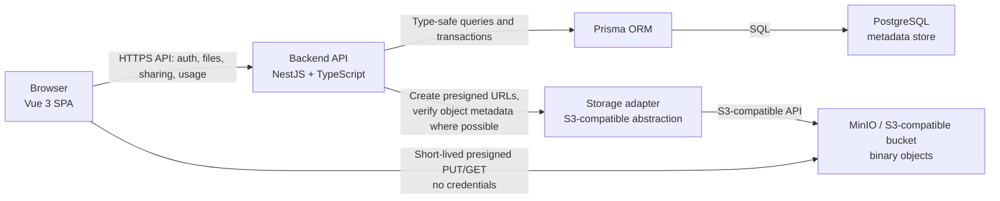

# C4 Container

## Statusz

Ez a dokumentum a tervezett MVP kontener szintu architekturajat rogziti. A leirt kontenerek kesobbi merfoldkovekben lesznek scaffoldolva es implementalva.

## Cel

A container nezet az alkalmazas futtathato nagyobb egysegeit es a koztuk levo felelossegi hatarokat mutatja. A kulcsfontossagu szerzodes az, hogy a frontend csak a backend API-val beszel, a binaris fajlok pedig privat object storage-ban vannak.

## Diagram

## Kontenerek

| Kontener | Technologia | Felelosseg |
|---|---|---|
| Browser SPA | Vue 3, Vite, TypeScript, Tailwind CSS | UI, route-ok, protected felulet, upload/download flow inditasa, felhasznalobarat allapotok. |
| Backend API | Node.js, NestJS, TypeScript | Auth, authorization, metadata muveletek, presigned URL kiadas, hibamodell, usage accounting. |
| Prisma ORM | Prisma | Adatbazis-hozzaferes, migraciok, tipusos query reteg, tranzakciok. |
| PostgreSQL | PostgreSQL | Felhasznalok, fajlmetaadatok, share link hash-ek, audit es tarhelyhasznalat. |
| Storage adapter | AWS SDK v3 S3-kompatibilis kliens mogotti absztrakcio | Provider fuggetlenebb storage muveletek es presigned URL generalas. |
| Object storage | MinIO lokalisan, kesobb AWS S3 vagy OCI Object Storage | Binaris kep- es videotartalom privat bucketben. |

## Fo adatfolyamok

- Upload: frontend metadata kerest kuld, backend validal es pending rekordot hoz letre, presigned PUT URL-t ad, frontend feltolt, majd confirm hivas utan a backend aktivva teszi a rekordot es novelheti a `usedStorageBytes` erteket.
- Preview/download: frontend read URL-t ker, backend ownership vagy share token alapjan dont, majd rovid eletu presigned URL-t ad biztonsagos response beallitasokkal.
- Soft delete/restore: backend metadata allapotot modosit; soft delete alatt a binaris objektum megmarad es tovabbra is beleszamit a kvotaba.

## Nem cel ebben a merfoldkoben

Nem keszul Docker Compose, NestJS scaffold, Vue scaffold, Prisma schema vagy runtime API. Ezeket a kesobbi merfoldkovek valositjak meg az itt rogzitett architekturadontesek alapjan.
