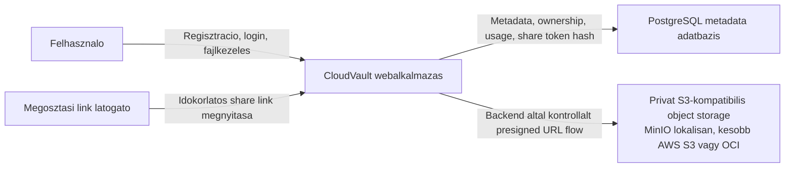

# C4 Context

## Statusz

Ez a dokumentum a 3. merfoldko architekturatervezesi eredmenye. A benne szereplo komponensek tervezett allapotot irnak le; futtathato alkalmazaskod ebben a merfoldkoben meg nem keszul.

## Cel

A context nezet azt mutatja meg, hogy a CloudVault rendszer milyen kulso szereplokkel es infrastruktura-elemekkel mukodik egyutt. A fo dontes: a bongeszo nem kozvetlenul kezeli az object storage credentialeket, hanem minden jogosultsagi dontes es presigned URL kiadas a backend API-n keresztul tortenik.

## Diagram

## Kontextus leiras

- A felhasznalo a Vue SPA-n keresztul hasznalja a rendszert, de a storage muveletekhez nem kap tartos credentialt.
- A backend API ellenorzi az authentikaciot, az ownership szabalyokat, a kvotat, a fajlstatuszt es a share link ervenyesseget.
- A PostgreSQL tarolja az alkalmazasi metaadatokat: felhasznalok, fajlok, share linkek, audit es usage adatok.
- A MinIO/S3-kompatibilis object storage tarolja a binaris fajltartalmat.
- A megosztasi link latogato nem kozvetlen S3 linket kap tartosan, hanem a backend ervenyesites utan rovid eletu read URL-t ad.

## Hatokor

Ebben a nezetben nem szerepel CI/CD, cloud deployment, monitoring dashboard, thumbnail generalas, video transzkodolas vagy multipart upload, mert ezek nem tartoznak az elso MVP implementacios hatokorebe.
